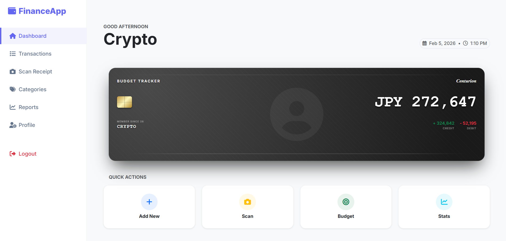

# 💰 Budget Tracker Pro (v3)

A comprehensive, AI-powered personal financial management tool built with **PHP** and **MySQL**. Track income, expenses, set budgets, and visualize your financial health with a modern, responsive UI.



## ✨ Features

- **📊 Interactive Dashboard**: Real-time overview of your Balance, Income, and Expenses with "Fade-in" animations.
- **🤖 AI Receipt Scanner**: Upload Japanese/English receipts, and the integrated **Google Gemini AI** will automatically extract the Store Name, Date, Amount, and Category.
- **🏷️ Custom Categories**: Create, edit, and color-code your own transaction categories.
- **📈 Advanced Reports**: Compare your spending Month-over-Month with visual percentage indicators.
- **🎯 Budget Goals**: Set monthly spending limits per category and get visual progress bars.
- **📱 Responsive Design**: Fully optimized for Mobile and Desktop with a collapsible sidebar and off-canvas menu.
- **🌍 Localization**: Support for multiple currencies (USD, JPY, EUR, GBP) via User Profile.
- **🔒 Secure**: User authentication with password hashing and session management.

## 🛠️ Tech Stack

- **Backend**: PHP 8.0+, MySQL (PDO)
- **Frontend**: HTML5, CSS3, Bootstrap 5.3, FontAwesome
- **AI/ML**: Google Gemini 1.5 Flash API (for OCR & Translation)
- **Charts**: Chart.js

## 🚀 Installation

1.  **Clone the Repository**
    ```bash
    ```bash
    git clone https://github.com/manojpoudel9256/budget-tracker.git
    ```

2.  **Database Setup**
    - Import `database.sql` into your MySQL database (e.g., via phpMyAdmin).
    - Run `migrate_db.php` if you are upgrading from an older version.

3.  **Configuration**
    - Rename `config.example.php` to `config.php`.
    - Open `config.php` and update your settings:
        ```php
        define('DB_HOST', 'localhost');
        define('DB_NAME', 'budget_tracker');
        define('DB_USER', 'root');
        define('DB_PASS', 'your_password');
        define('GEMINI_API_KEY', 'YOUR_GEMINI_API_KEY');
        ```

4.  **Run the Server**
    - Open a terminal in the project folder and run:
        ```bash
        php -S localhost:8000
        ```
    - Visit `http://localhost:8000` in your browser.

## 📂 Project Structure

```text
/
├── index.php             # Dashboard (Main Entry)
├── header.php            # Global Sidebar & CSS
├── process_receipt.php   # AI Logic for Receipt Scanning
├── scan_receipt.php      # Upload Interface
├── manage_categories.php # Category CRUD
├── reports.php           # Financial Reports
├── database.sql          # SQL Schema
└── uploads/              # Stored Profile & Receipt Images
```

## 📜 License

This project is open-source and available under the MIT License.
